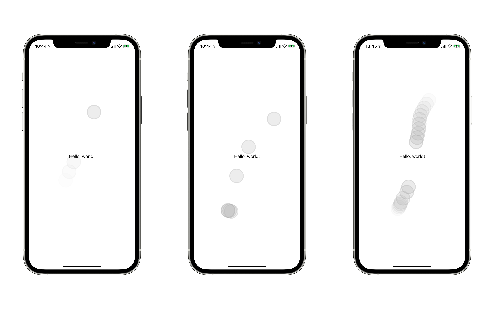

# UITouchHighlighter



> In action

Lightweight Swift Package to highlight user taps on the screen. Can be useful if you need to record demos.

## Setup

### Using SceneDelegates

You'll only need to edit a couple of things in the `SceneDelegate` file.

Replace the factory `UIWindow` by `UITouchHighlighter`. It's just a wrapper over `UIWindow`.

```swift
class SceneDelegate: UIResponder, UIWindowSceneDelegate {

    var window: UIWindow?
    
    ...
}
```

```swift
class SceneDelegate: UIResponder, UIWindowSceneDelegate {
    
    var window: UITouchHighlighter = {
        let window = UITouchHighlighter()
        return window
    }()

    ...
}
```

Aaaaand second and final part

```swift
...

func scene(_ scene: UIScene, willConnectTo session: UISceneSession, options connectionOptions: UIScene.ConnectionOptions) {
    
    let contentView = ContentView()
    
    if let windowScene = scene as? UIWindowScene {
        
        let window = UITouchHighlighter(windowScene: windowScene)
        window.rootViewController = UIHostingController(rootView: contentView)
        self.window = window
        window.makeKeyAndVisible()
    }
}

...
```
